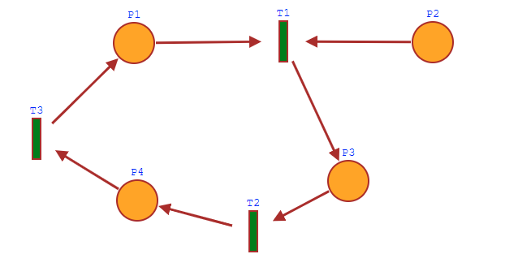

## Multithreading data processing 
The work was done according to the educational option twelfth task

Discipline: parallel programming

Python ver: 3.5 and higher

The main task of the work. Data processing from input.json file four different method:
1. [Semaphore](semaphore.py)
2. [Simulating a semaphore with a petri net](semaphorePetri.py)
3. [Thread pool](pool.py)
4. [Sumulation a thread pool with a petri net](poolPetri.py)

Input.json structure:
```json
{
  "PA": 1,
  "N": 5,
  "M": 2,
  "PT": 1000,
  "Books": {
    "Punishment Without Revenge": {"Author": "Lope de Vega", "Publisher":  "Oberon Books", "Year": 1631, "Total pages": 96},
    "The Master and Margarita": {"Author": "Mikhail Bulgakov", "Publisher":  "YMCA Press", "Year": 1967, "Total pages": 402},
    "Morphine": {"Author": "Mikhail Bulgakov", "Publisher":  "Noname", "Year": 1926, "Total pages": 333},
    "The Dog In The Manger": {"Author": "Lope de Vega", "Publisher":  "Oberon Books", "Year": 1618, "Total pages": 128},
    "Nineteen Eighty-Four": {"Author": "George Orwell", "Publisher":  "Secker & Warburg", "Year": 1949, "Total pages": 328}
  }
}
```

* PA - Deprecated (Not used)
* N - Total elements in 'Books' key
* M - Total parallel threads
* PT - Pause time in milliseconds
* Books - Dataset for multithreading processing

## License

See the [LICENSE](LICENSE) file for license rights and limitations (MIT).

## Description of the petri net implemented in [semaphorePetri.py](semaphorePetri.py)

### В данном примере приведена работа сети петри для 5 книг и 2 параллельных потоков

- Количество фишек в позиции **P1** эквивалентно атрибуту входного файла **N**
- Количество фишек в позиции **P2** эквивалентно атрибуту входного файла **M**
- Позиция **P3** эквивалентна функции с именем "**worker**"

Из-за невозможности показать задержку в схеме, фишка из позиции **P3** возвращается сразу в **P2**,
в программе же в функции worker отрабатывает задержка равная атрибуту из входного файла **PT**.

В данной сети Петри переход **T1** активируется в случае наличия необработанных книг и наличия
свободного потока, после активации перехода фишка попадает в позицию **P3** или в программе это
функция "**worker**". После завершения вычислений из позиции **P3** фишка возвращается в позицию **
P2** обозначая тем самым +1 готовый к работе поток. Если в переходе **P1**
ещё остались книги, то процесс повторится.


## Description of the petri net implemented in [poolPetri.py](poolPetri.py)

### В данном примере приведена сеть петри имитирующая пул потоков

- Количество фишек в позиции **P2** эквивалентно атрибуту входного файла **N**
- Количество фишек в позиции **P1** эквивалентно атрибуту входного файла **M**
- Позиция **P3** эквивалентна функции с именем "**worker**"
- Позиция **P4** эквивалентна освобождению потока в пуле (state - Done)

Переход **P1** содержит **M** активных потоков, **P2** содержит **N** книг, которые необходимо
обработать. Из позиции **P1**, **P2** через переход **T1** отбирается **N** фишек, они попадают в
позицию **P3** (worker) после чего из данной позиции через переход **T2** по мере завершения работы
попадают в позицию **P4** и затем через переход **T3** возвращаются в позицию **P1**. В случае если
в пуле нет заданий на обработку фишки из **P1** убираются, так как потоки завершаются.


